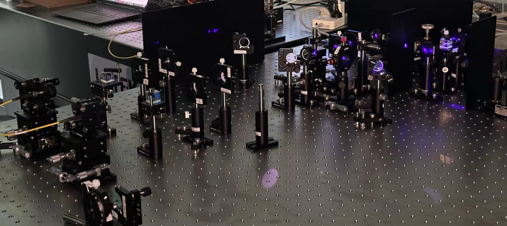

[report]()

- Higher-dimensional degrees of freedom of photons can encode much more information than traditional qubits. However, the large dimensionality of these states, poses an intriguing challenge for their measurement. Based on the theory of weakvalue, this work proposed a solution to directly measuring the joint wavefunction of biphoton. 

- Conducted extensive research on weak measurement, gaining understanding of weak values, weak measurements, projective measurements, and non-local measurements. 

- Programmed simulation algorithm using Matlab, prove this solution theoretically.

- Built a biphoton entanglement source based on SPDC process to test this solution empirically, gaining basic skills in optical platform operations.

- Successfully extended the direct wavefunction measurement technique to non-local continuous variable systems, significantly improving measurement efficiency.

