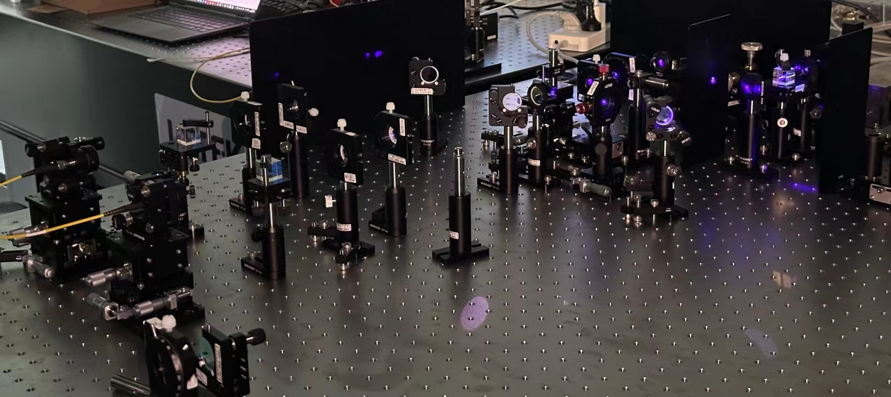

[report](../files/Direct_measurement.pdf)

Higher-dimensional degrees of freedom of photons can encode much more information than traditional qubits. However, measuring these states is quite challenging due to their large dimensionality. Based on the theory of weakvalue, this work proposed a solution to measure the joint wavefunction of biphoton directly. 

- Proved that the joint wavefunction of biphoton can be determined by measuring the modular values of the momentum projection operator of the biphoton.

- Designed 
 the experimental scheme for measuring the desired modular values.  Utilized the polarization state of biphoton as the pointer, enabling the measurement of modular values in a single scan, significantly enhancing the efficiency of the measurement process.

- Programmed algorithm to simulate the evolution of the biphoton states based on the Hamiltonian describing the interaction between the observable and the pointer. The simulated results demonstrated the joint wavefunction of biphoton can be measured accurately for states in different spatial modes.

-  Built a biphoton entanglement source based on BBO crystal. The photon pairs generated by the SPDC process are correlated in spatial wavefunction, which can be used for testing.

- Test the proposed solution based on the entanglement source and validate the theory (in progress).

